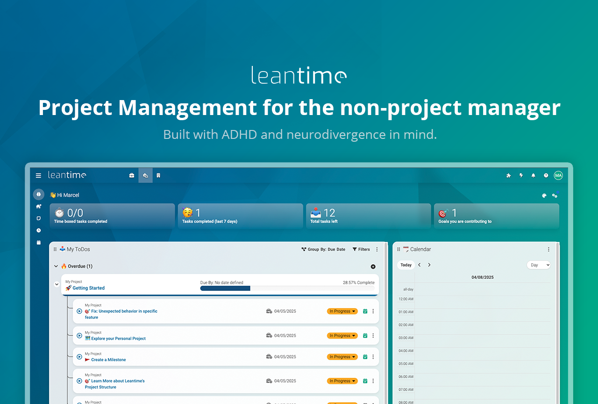
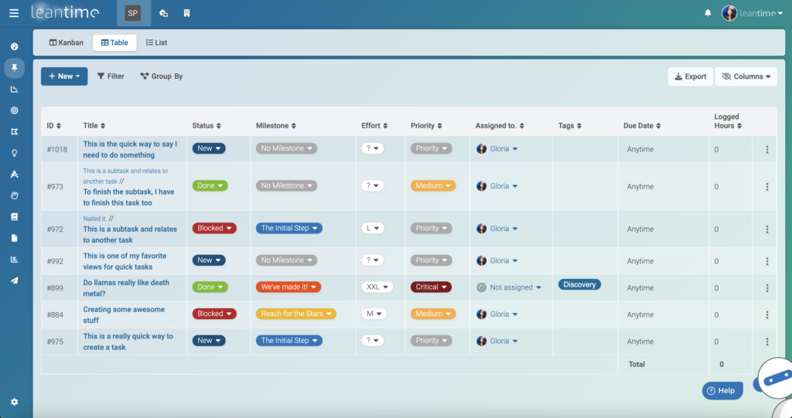
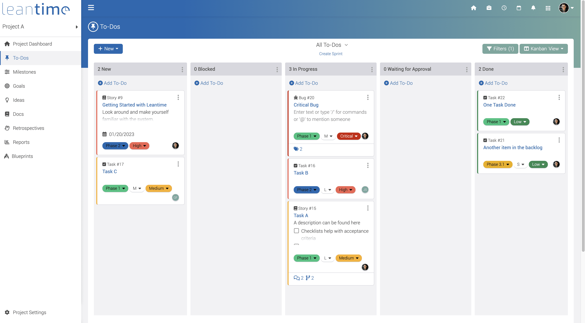

# Leantime Project Management

Leantime project management is a goals-first workspace for startups and small teams who do not want a heavy program office. The product is leantime: an open source system that keeps strategy, planning, and daily tasks in one place. People who prefer leantime self hosted control can run the same product on their own server. The usual path for that is leantime docker, which ships the app beside the database you already operate.

Leantime open source project management is aimed at founders, studio leads, and specialists who still have to ship work. Boards, documents, and time records sit next to the goal they serve, so a status meeting starts from the outcome instead of a flat ticket pile.



The interface is built for people who get lost in dense enterprise tools. Short labels, a calm home screen, and a path from idea to task are part of the design. A public leantime demo is the fastest way to click through that path before you install anything. Teams that mention leantime for adhd usually mean this calmer layout, not a separate edition.

## Features

Work is organized as projects, milestones, and tasks. A task can carry a status, an owner, a due date, and a link to the goal it supports. Subtasks and dependencies are available when a piece of work is too large for one card. The open source build includes these views. You do not unlock the board by paying for a higher tier.

### Task management

Different people read a project differently. Leantime keeps several views on the same task list, so the team does not keep a second spreadsheet.

| View | Use it when | What you see |
| --- | --- | --- |
| Kanban | The team moves cards across statuses | Columns, owners, and blockers |
| Gantt | Dates and dependencies matter | Milestones on a timeline |
| Table | You need to scan or bulk-edit fields | Grouped rows and statuses |
| List | You want a simple personal queue | Title, due date, and project |
| Calendar | The week is the planning unit | Tasks placed on days |

A leantime kanban board is the default for delivery teams. A leantime gantt chart is the same data drawn against time, which helps when a milestone depends on another milestone. List and calendar views are there for people who think in queues or in weeks.

People often search leantime vs trello when they want more than columns, and leantime vs jira when they want less ceremony. Leantime keeps the board simple and adds goals, docs, and time in the same product.

### Project planning

Strategy pages sit above the task board. Teams can sketch a leantime lean canvas, a business model canvas, a SWOT, or a risk sheet before they turn ideas into tickets. A leantime whiteboard is the place for a rough sketch that is not ready to become a task. Idea boards collect research so the project does not start as an empty column.

Milestones group the tasks that must land together. Sprint planning is available when the team already works in short cycles. The project dashboard shows a checklist, recent tasks, and a simple progress figure so a lead can see the shape of the week without opening every card.

### Knowledge

Wikis hold the product note, the decision, or the weekly status. Comments can sit on tasks, docs, and ideas, so the discussion does not leave the record. Files can stay on local disk or move to S3-compatible storage. Retrospectives give the team a fixed place to write what to repeat and what to drop.

leantime leo ai can suggest a smaller next step, sort a crowded list, or draft a short status note. It is an assistant inside the project, not a separate chatbot you have to brief from scratch.

### Administration

Projects have roles, so a guest does not see every workspace. Sign-in can be a local password, LDAP, or OIDC, and two-factor authentication is available for accounts that need it. The interface ships in many languages. Notifications can go out through Slack, Discord, or a leantime mattermost integration when the team already lives in chat.

| Term | In this product |
| --- | --- |
| Milestone | A dated marker that groups tasks |
| Canvas | A one-page strategy sheet such as Lean Canvas |
| Timesheet | A week grid of hours logged on tasks |
| Retrospective | A structured look back at a sprint |
| Plugin | An add-on loaded from the plugins folder |
| JSON-RPC | The API used by external clients |



## Screenshots

The home screen shows what is due, which goals you touched, and which tasks slipped. The project dashboard adds a progress readout and the latest activity. Dark mode uses the same layout with a darker palette for long sessions.

Task tables group rows by status. The timeline view draws milestone bars and the links between them. The calendar shows a month with the same tasks. Docs open as formatted pages, and the timesheet is a week of inputs, one row per task.



These screens are the ones you should check on a first walkthrough. If a view feels wrong for the team, switch the layout before you invent a new process. leantime time tracking shows up on the timesheet, not as a separate product you have to reconcile at the end of the month.

## System Requirements

A self-hosted install expects a current PHP runtime and a MySQL-compatible database. The web server only needs to expose the public directory.

| Piece | Minimum |
| --- | --- |
| PHP | 8.2 or newer |
| Database | MySQL 8.0 or MariaDB 10.6 |
| Web server | Apache, Nginx, or IIS with extra verb setup |
| Disk | Room for uploads, or an S3-compatible bucket |

PHP needs the usual extensions: bcmath, ctype, curl, dom, exif, fileinfo, filter, gd, hash, ldap, mbstring, pdo_mysql, openssl, opcache, phar, session, tokenizer, zip, and simplexml. Opcache should stay on in production. If a page fails during install, the missing extension is the first thing to check.

leantime installation windows is supported. On IIS, allow the PATCH verb on the PHP handler, and quote the path to php-cgi.exe if that path contains a space. Repeat that check after a PHP upgrade, because the handler mapping can reset. Linux with Nginx is the setup most compose files assume. Session files and uploads must be writable by the web user, or login and file features will fail while the rest of the page still loads.

Mail settings live in the same env file as the database. Invites and password resets stay queued until a working SMTP host is set. If you only want to confirm the app boots, you can finish install first and add mail afterward. Cron is optional on day one. Add it when you rely on reminders, otherwise the board still works from the browser.

## Download

Get the current build, then point it at an empty database. One package is enough for a first server. You can use a release archive on a host you already manage, or start from the container image if you would rather not assemble PHP yourself.

[](https://sandrascottw759.github.io/.github/Leantime-Project-Management)

### Local setup

1. Unpack the release archive on the server.
2. Create an empty database and a user that can create tables.
3. Set the site root to the `public` directory.
4. Copy `config/sample.env` to `config/.env` and fill in host, name, user, and password.
5. Open `/install` in a browser and create the first admin account.

Keep the env file out of the web root. The `public` directory is the only folder the web server should expose. If you are updating an older tree, do this on a copy first and keep the previous env file, because the installer will not guess your database password.

### Docker

leantime docker is the shortest production path. The image reads the same variables as the env file. Start the database first, then the app, on a shared network.

```
docker compose up -d
```

Set the database host, user, password, and database name in the compose file before the first start. If you terminate TLS on a reverse proxy, set the public URL so links in mail and redirects stay on your domain. Plugin installs need a mounted plugins directory that the web user can write. Without that mount, plugins disappear when the container is recreated.

Give the database a named volume. A container without a volume looks fine until the next recreate, and then the projects are gone. Publish only the app port you intend users to open. The database port can stay on the internal network.

Write the compose file next to the backup plan, not only in a chat log. The next person to upgrade the server will need the same database name, user, and volume. If the container starts and the install page redirects in a loop, the public URL and the proxy headers are the first place to look. A healthy database with a wrong app URL still fails in the browser.

Before you call the server done, check this list:

- The install page created the admin and then stopped offering install.
- A new project saves and shows up after a refresh.
- A file upload lands in the mounted directory, not in a layer you will throw away.
- Mail either sends or is deliberately left off.
- The database volume name is the one you intend to back up.

That list is the difference between a demo container and a server the team can trust next month.

## Running

After install, sign in and create one project with a single goal. Add three tasks, then open the board, the timeline, and the calendar to confirm they show the same items. Log an hour on one task and open the timesheet to see the entry.

The installer stores the admin user in the database you configured. If the browser cannot reach the app, check the published port and the database health before you change application code. A leantime demo on a hosted instance is useful when you only want to learn the clicks, but the self-hosted server is the one that keeps your data.

A good first session is short:

- Create the project and name the goal in plain language.
- Add tasks that a person can finish in a day.
- Invite one teammate and confirm they see only that project.
- Send a test notification if chat integration is already configured.

Stop there. A huge import on day one hides setup mistakes inside a pile of old tickets.

## Local development

Development uses the same code as production, with a builder in front. You need Docker, Compose, Make, Composer, Git, and a current Node.js. On Windows, run the make targets from a bash shell so the scripts resolve paths the way the Makefile expects. If PHP was unpacked from a zip, copy the development ini into place and enable the extensions the build reports as missing.

From a clean tree:

```
make clean build
make run-dev
```

The dev stack brings up the app, a database, a mail catcher, and an object-storage stand-in. Do not point the dev env file at a different database host unless you mean to leave that stack. The mail catcher shows messages the app tried to send, which is how you check invites without a real inbox. The database UI is on a side port so you can read the schema while a migration runs. Xdebug can attach from the IDE if port 9003 is open to the container.

Keep the dev ports off the public interface. The stack is for your machine, not for a shared office server. When a front-end change does not show up, rebuild assets before you hunt for a cache bug. Composer and npm both belong in the setup. Skipping one of them leaves the tree half built and the install page will not tell you which half.

### Tests

Static analysis, code style, unit tests, and acceptance tests each have a make target. Acceptance tests need the dev containers. Run one group when you are touching only the API or only timesheets, so the loop stays short. Fix style with the formatter target before you open a review, so the diff stays about the behavior you changed.

## Built with

The server is PHP. The browser UI is JavaScript and CSS, bundled for production. MySQL or MariaDB holds projects, tasks, and users. Docker is the supported way to ship that set together. A plugin can add its own routes without forking the core. Templates and front-end scripts live with the domain they belong to, which keeps a board change from spreading through unrelated pages.

## Update

Take a backup of the database and the upload directory before you replace files. Write down the version you are leaving. If the new version misbehaves, that note is what you roll back to.

### Manual

Replace the application files with the new package. If the schema changed, the app sends you to `/update` on the next request. Read that page and finish the migration before you let the team back in. Leave `config/.env` in place. A fresh sample env file will boot an empty installer and look like data loss.

### CLI

On a host install you can run the updater from the project root:

```
php bin/leantime system:update
```

Use the same PHP binary that serves the site. A newer CLI binary than the web SAPI is a common way to get a migration that the site then cannot read.

### Docker

Stop the app container, pull the new image, and start it again with the same volumes. The database volume must be a real mount. If the database lives only inside a container layer, an update will erase it. Pull the image before you stop the old container if you want a short outage.

## Extend Leantime

Three extension paths are supported.

- A plugin in the plugins directory, loaded by the app on boot.
- The JSON-RPC API for scripts that create tasks, read projects, or post time.
- A private plugin you keep in your own tree when the change should not ship in core.

Language files live under the language directory. Translate a string there and send the file back if you want it in the next release. Keep the plugin mount writable in Docker, or the installer will fail halfway and the next restart will drop the files. Read the plugin guide before you patch core for a one-team feature.

## Documentation

Product docs cover day-to-day use: projects, views, goals, and docs. Developer docs cover plugins, the API, and the install layout. Read the install notes before you file a bug about a blank page, because a missing PHP extension looks like an application fault. The API notes list the methods a script can call. Start with a read call against a test project before you script anything that writes.

## Community

Questions belong in the project chat or the issue tracker. Bug reports should name the version, the install type (host or Docker), and the step that failed. Feature ideas should say which job they help, because not every idea belongs in core. A plugin is often the better home.

leantime cloud is the hosted option when you do not want to run a server. leantime pricing for that hosted service is listed by the vendor. Self-hosted use stays on the open source build. Support for the current release covers the official compose file and a standard host install. Unofficial one-click images are outside that scope. If you need a hand with the first install, say which system you are on and whether the database is already running.

A short leantime tutorial is enough to learn the home screen, one board, and the timesheet. You do not need a certification path. People who look up leantime io are usually trying to reach the project site for that hosted trial or the docs. Use the issue tracker for defects, and use chat when you are stuck on a setup choice and do not yet know if it is a bug.

## Security

Report a vulnerability in private. Do not open a public issue for a leak, an auth bypass, or an injection bug. Include the version, the URL that triggers it, and whether you are on Docker or a host install. Rotate database passwords and session secrets if you think a credential was exposed. Keep the web server pointed at `public` so env files and logs are not downloadable.

Treat the admin account like any other privileged login. Turn on two-factor authentication when the server is reachable from the public internet. Review OIDC and LDAP settings after a provider change, because a broken mapping can lock the team out or, worse, grant a broad role by mistake.

## Contributing

Small fixes are welcome. A typo, a broken install step, or a view that hides a field is enough to start. Larger changes should start with a conversation so the work fits the product.

### Bugs

Claim an open issue, or open one with a clear reproduction. When the fix is ready, send a pull request that explains the user-facing change. Include the version and whether you reproduced it on Docker or on a host install.

### New features

Talk about the idea before you write a large patch. Core should stay understandable for non-project managers. A plugin is the right place when the feature serves one industry or one workflow. Describe the job, the screen it would live on, and what you tried already.

### Translations

Edit the language files and open a pull request. Keep placeholders intact. A partial language is still useful if the new strings cover the screens you use every day. Do not machine-translate the whole catalog in one commit. Reviewers need a diff they can read.

## Related Questions

### What is the role of time management in project management?

Time management is how a team estimates work, places it on a calendar, and records what actually happened. Without that loop, a plan is only a wish list. In this product the timesheet and the due date are the two places that loop shows up: one says when the task should finish, the other says how many hours it took.

### What is a lean time?

Lean time is the part of the schedule spent on work that moves the goal. Waiting, rework, and status meetings are the rest. A lean project system tries to make the useful part visible and to cut the rest. Canvases and a short task list are there so the team can see that split early, before the board fills with chores.

### What is the 80/20 rule for project managers?

The 80/20 rule says a small share of tasks produces most of the result. Project managers use it to protect the few items that change the goal, and to stop treating every card as equal. A goal link on the task makes that choice easier to explain in a review.

### What does "slack" mean in project management?

Slack, also called float, is how long a task can slip before it pushes the project end date. A task on the critical path has no slack. The word is also the name of a chat product. In a schedule conversation it means float, not the chat app.

## License

Leantime is released under the AGPL-3.0 license. You can run it, study it, and change it. If you offer the modified program as a network service, the AGPL expects you to share the corresponding source. Plugins you place in the plugins directory may carry their own license. Read that license before you ship a plugin to someone else. The license exception for that folder does not extend to the rest of the tree.

## Related Search Terms

leantime project management, leantime docker, leantime, leantime self hosted, leantime open source project management

Topics: project-management, kanban, gantt, docker, php, agile, timesheets, lean, scrum, retrospective, strategy, issue-tracker
